# Architecture Diagrams - Events Branch Refactoring

This document contains enhanced visual diagrams illustrating the architectural improvements made during the Octopus events branch refactoring. These diagrams use Mermaid syntax and provide color-coded, interactive visualizations.

## How to View These Diagrams

- **GitHub/GitLab**: Automatically renders Mermaid diagrams
- **VS Code**: Install Mermaid preview extensions
- **Online**: Copy/paste into [Mermaid Live Editor](https://mermaid.live/)
- **Documentation platforms**: Most modern platforms support Mermaid

---

## Event Flow Transformation

This diagram shows the fundamental change in how events flow through the system before and after the refactoring.

**Key Improvements:**
- 🔴 **Red (Before)**: Protocol knowledge scattered throughout apps
- 🟢 **Green (After)**: Clean domain events with centralized conversion

---

## Detailed System Architecture

This comprehensive diagram shows all components and their relationships in the new architecture.

**Architecture Layers:**
- 🔵 **Network Boundary**: Protocol handling and input reception
- 🟢 **Conversion Layer**: Factory pattern for protocol-to-domain conversion
- 🟠 **Domain Events**: Clean, semantic business events
- 🟣 **Event System**: Routing and app management
- 🟢 **Applications**: Pure business logic, no protocol concerns

---

## Developer Experience Transformation

This diagram illustrates how the refactoring dramatically simplifies the developer experience.

```mermaid
graph LR
    subgraph "Before: Complex Development Process"
        B1[👨‍💻 App Developer] --> B2[📚 Learn Protobuf Schemas]
        B2 --> B3[🔧 Handle Raw Protocol Events]
        B3 --> B4[🔄 Convert to Business Logic]
        B4 --> B5[✨ Implement Features]
        
        style B1 fill:#ffebee,stroke:#d32f2f,stroke-width:2px
        style B2 fill:#ffebee,stroke:#d32f2f,stroke-width:2px
        style B3 fill:#ffebee,stroke:#d32f2f,stroke-width:2px
        style B4 fill:#ffebee,stroke:#d32f2f,stroke-width:2px
        style B5 fill:#ffebee,stroke:#d32f2f,stroke-width:2px
    end
    
    subgraph "After: Simplified Development Process"
        A1[👨‍💻 App Developer] --> A2[🎯 Handle Semantic Events]
        A2 --> A3[✨ Implement Features]
        
        style A1 fill:#e8f5e8,stroke:#388e3c,stroke-width:2px
        style A2 fill:#e8f5e8,stroke:#388e3c,stroke-width:2px
        style A3 fill:#e8f5e8,stroke:#388e3c,stroke-width:2px
    end
```

**Benefits:**
- ⏰ **Time Savings**: 60% reduction in development steps
- 🧠 **Cognitive Load**: No need to learn complex protocols
- 🎯 **Focus**: Developers can focus on business logic
- 🐛 **Fewer Bugs**: Type-safe, validated events

---

## Event Type Evolution

This diagram shows how different event types evolved through the refactoring phases.

---

## Testing Improvement Visualization

Shows how testing became dramatically simpler with domain events.

```mermaid
graph LR
    subgraph "Before: Complex Test Setup"
        T1[Create Protobuf Event] --> T2[Set Raw Fields<br/>type: :AXIS_X_1<br/>value: -1]
        T2 --> T3[❓ What does this test?]
        
        style T1 fill:#ffebee,stroke:#d32f2f
        style T2 fill:#ffebee,stroke:#d32f2f
        style T3 fill:#ffebee,stroke:#d32f2f
    end
    
    subgraph "After: Clear Test Intent"
        T4[Create Domain Event] --> T5[Set Semantic Fields<br/>type: :joystick<br/>direction: :left]
        T5 --> T6[✅ Crystal clear intent]
        
        style T4 fill:#e8f5e8,stroke:#388e3c
        style T5 fill:#e8f5e8,stroke:#388e3c
        style T6 fill:#e8f5e8,stroke:#388e3c
    end
```

---

## Factory Pattern Detail

Shows how the Factory pattern centralizes all protocol conversion logic.

**Key Benefits:**
- 🎯 **Single Responsibility**: Factory only handles conversion
- 🧹 **Clean Domain Events**: No protocol knowledge
- 🔧 **Easy Maintenance**: Protocol changes isolated to Factory
- ✅ **Testable**: Each conversion function easily tested

---

*These diagrams provide enhanced visualization of the architectural improvements. For text-based diagrams that work in any environment, refer to the main [COMMIT_SUMMARY.md](COMMIT_SUMMARY.md).* 