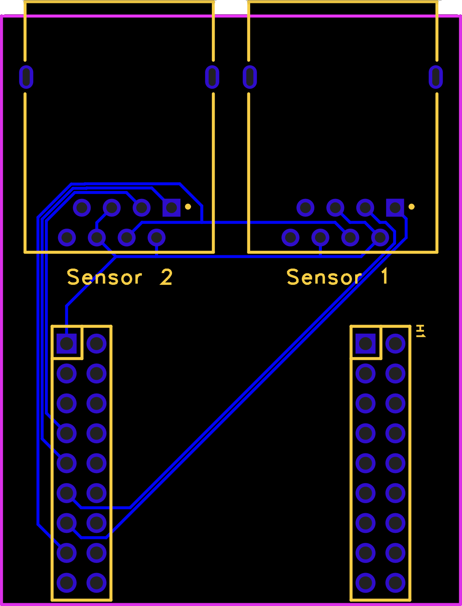

# HC-SR04 Sensor Adapter Boards (RJ45/CAT5)

This repository documents two custom PCB boards designed to simplify the integration of **HC-SR04 ultrasonic sensors** into a distributed setup using **RJ45 connectors** and **CAT5/CAT6 cabling**. The boards are designed to interface directly with the **QuinLED-ESP32** module, particularly in conjunction with the **QuinLED-Dig-Uno** system.

---

## Boards Overview

### 1. SensorBoard (Breakout)

A small breakout PCB that adapts a standard **HC-SR04** ultrasonic sensor to a **RJ45 (8P8C)** jack. This allows the sensor to be placed remotely and connected via common Ethernet cables.

#### Features:

* 4-pin male header for HC-SR04 sensor
* RJ45 socket for CAT5/6 cable
* Compatible with both 3.3V and 5V sensors
* Pin assignment designed for optimal signal/GND twisted pair usage

### 2. AdapterBoard

This board acts as a bridge between the **QuinLED-Dig-Uno** and **QuinLED-ESP32** boards. It connects two RJ45 sockets directly to specific ESP32 GPIO pins via passthrough headers.

#### Features:

* Stackable with QuinLED boards
* Connects **two RJ45 jacks** to ESP32 GPIOs
* Uses a single row of one 2x9 header (female top / male bottom)
* Shared power and ground lines
* Bottom-layer routing

---

## RJ45 Pinout

All connections via RJ45 follow this shared pinout:

| RJ45 Pin | Function | Twisted Pair | Notes               |
| -------- | -------- | ------------ | ------------------- |
| 1        | TRIG     | Pair 1       | Output from ESP32   |
| 2        | GND      | Pair 1       | Shared              |
| 3        | ECHO     | Pair 2       | Input to ESP32      |
| 4        | VCC      | Pair 3       | Shared (3.3V or 5V) |
| 5        | GND      | Pair 3       | Shared              |
| 6        | GND      | Pair 2       | Shared              |
| 7        | —        | Pair 4       | Unused              |
| 8        | —        | Pair 4       | Unused              |

---

## AdapterBoard Wiring Summary

### ESP32 Header Mapping (1 Row)

| HEADER Pin | ESP32 GPIO | Function   |
| ---------- | ---------- | ---------- |
| Pin 1      | GND        | GND        |
| Pin 3      | —          | Unused     |
| Pin 5      | —          | Unused     |
| Pin 7      | GPIO35     | ECHO2      |
| Pin 9      | GPIO33     | TRIG2      |
| Pin 11     | GPIO34     | ECHO1      |
| Pin 13     | GPIO14     | TRIG1      |
| Pin 15     | 3.3V       | Shared VCC |
| Pin 17     | —          | Unused     |

### Sensor 1 (RJ45 Connector 1)

| Function | ESP32 GPIO | HEADER Pin | RJ45 Pin | Notes             |
| -------- | ---------- | ---------- | -------- | ----------------- |
| TRIG1    | GPIO14     | Pin 13     | Pin 1    | Output            |
| GND      | —          | Pin 1      | Pin 2    | Shared            |
| ECHO1    | GPIO34     | Pin 11     | Pin 3    | Input (interrupt) |
| VCC      | 3.3V       | Pin 15     | Pin 4    | Shared            |
| GND      | —          | Pin 1      | Pin 5    | Shared            |
| GND      | —          | Pin 1      | Pin 6    | Shared            |

### Sensor 2 (RJ45 Connector 2)

| Function | ESP32 GPIO | HEADER Pin | RJ45 Pin | Notes             |
| -------- | ---------- | ---------- | -------- | ----------------- |
| TRIG2    | GPIO33     | Pin 9      | Pin 1    | Output            |
| GND      | —          | Pin 1      | Pin 2    | Shared            |
| ECHO2    | GPIO35     | Pin 7      | Pin 3    | Input (interrupt) |
| VCC      | 3.3V       | Pin 15     | Pin 4    | Shared            |
| GND      | —          | Pin 1      | Pin 5    | Shared            |
| GND      | —          | Pin 1      | Pin 6    | Shared            |

---

## How to Use

1. Connect HC-SR04 sensors to SensorBoards using 4-pin headers.
2. Use CAT5/CAT6 cables to connect SensorBoards to AdapterBoard.
3. Plug the AdapterBoard between the QuinLED-Dig-Uno and QuinLED-ESP32 boards.
4. Power the system (3.3V or 5V depending on sensor compatibility).
5. Read distances on GPIO34 (Sensor 1) and GPIO35 (Sensor 2), trigger using GPIO14 and GPIO33.
 